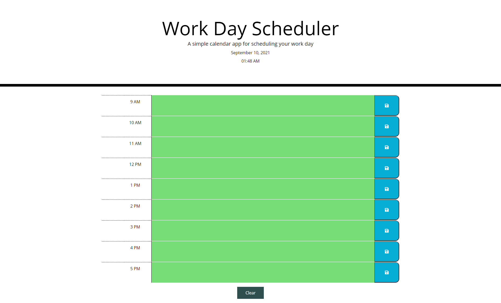

# Day Planner

## Description
- My motivation for this project was to create a simple calendar application that allows a user to save events for each hour of the day.
- This was accomplished through using dynamically upadated HTML and CSS powered by jQuery. 

## Technology Used
- HTML
- CSS
- JavaScript

## Screenshot

## Link
https://mistwhit.github.io/day-planner/